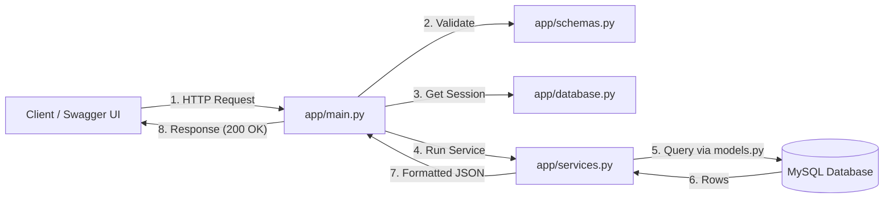

# Employee Management API

A REST API to manage employee records built using **FastAPI**, **SQLAlchemy**, and **MySQL**. Data is permanently stored in a database and persists across server restarts.

## Technologies Used

- **Language:** Python 3.12
- **Framework:** FastAPI
- **Database:** MySQL 8+
- **ORM:** SQLAlchemy 2.0
- **Driver:** PyMySQL & Cryptography
- **Validation:** Pydantic v2
- **Server:** Uvicorn


## Project Structure

```text
FastAPI-EmpManagement/
├── app/
│   ├── __init__.py
│   ├── database.py       # Engine, session, and get_db dependency
│   ├── models.py         # SQLAlchemy Employee table model
│   ├── schemas.py        # Pydantic schemas for request/response validation
│   ├── services.py       # Database CRUD operations
│   └── main.py           # FastAPI routes
├── screenshots/          # Swagger UI test screenshots
├── .env.example          # Environment template
├── .gitignore
├── requirements.txt
└── README.md
```

## Project Architecture & File Breakdown

The project follows a **layered separation-of-concerns** architecture where each file handles a distinct responsibility:

### 1. `app/database.py` — Database Engine & Session Management
* **Database Connection:** Constructs a secure MySQL connection string using `URL.create()` to safely encode special characters from environment variables.
* **Engine with Health Checks:** Configures SQLAlchemy's `create_engine` with `pool_pre_ping=True` to automatically detect and recover from dropped or idle database connections.
* **Session Lifecycle (`get_db`):** Implements a generator-based dependency (`yield`) that creates a unique `SessionLocal` instance for each incoming HTTP request and guarantees it is cleanly closed in a `finally` block to prevent connection leaks.
* **Declarative Base:** Instantiates `Base = declarative_base()`, which serves as the foundation class for all ORM models.

### 2. `app/models.py` — SQLAlchemy ORM Data Model
* **Table Mapping:** Defines the `employees` table schema inside MySQL mapped to the `Employee` Python class.
* **Columns & Constraints:**
  * `id`: Auto-incrementing, indexed primary key.
  * `name`, `department`, `primary_skill`, `location`: Required string fields (`nullable=False`).
  * `email`: Indexed unique string (`unique=True`) preventing duplicate email entries at the database level.
  * `work_mode`: Enforced by MySQL Enum constraint strictly accepting `WFH` or `WFO`.
  * `is_active`: Boolean flag indicating employment status (defaults to `True`).
  * `created_at`: Auto-timestamped using MySQL's server-side `func.now()`.

### 3. `app/schemas.py` — Pydantic Request & Response Schemas
* **Data Transfer Objects (DTOs):** Enforces data validation rules for incoming requests and standardizes outgoing JSON responses.
* **WorkMode Enum:** Validates that work mode is strictly `"WFH"` or `"WFO"`.
* **Input Sanitization:** Uses `@field_validator` to reject empty or whitespace-only strings for text fields.
* **Request Schemas:**
  * `EmployeeInput`: Validates payloads for creating new employees (`POST /employees`).
  * `EmployeeEdit`: Validates payloads for editing employees (`PUT /employees/{id}`), allowing updates to `is_active`.
* **Response Schemas:**
  * `EmployeeDetails`: Formats single employee records with `from_attributes=True` to read directly from SQLAlchemy ORM objects.
  * `PaginatedEmployeeResponse`: Wraps employee lists into an envelope with metadata (`total`, `limit`, `offset`, `items`, and `message`).

### 4. `app/services.py` — Business Logic & Database Queries
* **Decoupled Business Logic:** Encapsulates all database queries and transactions, keeping route handlers lean and focused solely on HTTP handling.
* **Duplicate Prevention:** `is_email_taken()` performs case-insensitive email uniqueness checks using SQL `func.lower()`.
* **Search, Filtering & Pagination:** `fetch_employees_paginated()` dynamically constructs SQL queries directly on the database:
  * Case-insensitive partial name search (`LIKE %...%`).
  * Conditional filtering by `department`, `work_mode`, and `is_active`.
  * Accurate pre-pagination count via `query.count()`.
  * Deterministic sorting (`id ASC`) with database-level `LIMIT` and `OFFSET`.
* **Transaction Management & Error Handling:** Wraps database modifications in `try-except` blocks with `db.rollback()` on failures. Returns clear HTTP exceptions for duplicate emails (`400`), foreign key conflicts (`409`), or internal errors (`500`).

### 5. `app/main.py` — FastAPI Routing & Controllers
* **Application Entry Point:** Configures the FastAPI app instance, metadata, and auto-generates interactive Swagger UI docs at `/docs`.
* **Automatic Table Creation:** Calls `models.Base.metadata.create_all(bind=engine)` on startup to ensure the database schema exists.
* **Endpoint Routing:** Declares RESTful endpoints for root, health check, and employee CRUD operations.
* **Parameter Validation:** Defines path constraints (`id > 0`) and query parameter validations (`limit: 1–100`, `offset >= 0`, `work_mode` Enum) to automatically return standard HTTP `422 Unprocessable Content` errors for invalid inputs.
* **Dependency Injection:** Injects database sessions into route handlers using `Depends(get_db)`.

---

## Application Request Flow

1. **Request & Validation:** The client sends an HTTP request to `app/main.py`. FastAPI validates query parameters and request bodies against `app/schemas.py` (returning HTTP `422` if invalid).
2. **Session Injection:** `app/database.py` generates a clean MySQL session and injects it into the endpoint handler via `Depends(get_db)`.
3. **Business Logic & Query:** `app/main.py` invokes `app/services.py`, which constructs an optimized SQLAlchemy query mapped to `app/models.py`.
4. **Database Execution:** MySQL executes the query directly (`WHERE` filters, `COUNT(*)`, `ORDER BY id ASC`, `LIMIT`, `OFFSET`) and returns the rows.
5. **Serialization & Cleanup:** Pydantic converts database models into the response schema (`PaginatedEmployeeResponse`), `get_db` automatically closes the session (`db.close()`), and the client receives the `200 OK` JSON response.

---

## Application Request Flow



## Database Setup & Configuration

### 1. Create MySQL Database
Log in to MySQL:
```bash
mysql -u root -p
```
Run this command:
```sql
CREATE DATABASE IF NOT EXISTS employee_db;
EXIT;
```

### 2. Configure `.env`
Create a `.env` file in the project root:
```env
DATABASE_HOST=localhost
DATABASE_PORT=3306
DATABASE_USER=root
DATABASE_PASSWORD=YOUR_MYSQL_PASSWORD
DATABASE_NAME=employee_db
```

## How SQLAlchemy Connects to MySQL

- **Connection URL:** Uses the format `mysql+pymysql://<user>:<password>@<host>:<port>/<db_name>`.
- **Engine & Session:** `create_engine` creates the connection, and `sessionmaker` generates sessions.
- **Session Lifecycle (`get_db`):** Uses a generator (`yield`) as a FastAPI dependency. A session is created for each request and safely closed in a `finally` block.
- **Auto Table Creation:** `models.Base.metadata.create_all(bind=engine)` creates the `employees` table automatically when the app starts.

---

## How to Run

1. **Activate Virtual Environment:**
   ```bash
   source venv/bin/activate
   ```
2. **Install Dependencies:**
   ```bash
   pip install -r requirements.txt
   ```
3. **Start the Server:**
   ```bash
   uvicorn app.main:app --reload --port 8001
   ```
4. **Open Swagger Documentation:**
   Go to [http://127.0.0.1:8001/docs](http://127.0.0.1:8001/docs) to test the endpoints.

---

## API Endpoints

| Method | Endpoint | Description | Status Codes |
|---|---|---|---|
| `GET` | `/` | Welcome message | `200` |
| `GET` | `/health` | Health check | `200` |
| `POST` | `/employees` | Add new employee | `201`, `400`, `422` |
| `GET` | `/employees` | List employees (with search, filters & pagination) | `200`, `422` |
| `GET` | `/employees/{id}` | Get employee by ID | `200`, `404`, `422` |
| `PUT` | `/employees/{id}` | Update employee details | `200`, `400`, `404`, `422` |
| `DELETE` | `/employees/{id}` | Delete employee | `200`, `404`, `422` |

---

## Search, Filtering & Pagination (`GET /employees`)

The `GET /employees` endpoint supports optional query parameters for search, filtering, and pagination directly at the database query level using SQLAlchemy.

### Query Parameters

| Parameter | Type | Default | Constraints | Description |
|---|---|---|---|---|
| `search` | `string` | `None` | Optional | Partial, case-insensitive search by employee name |
| `department` | `string` | `None` | Optional | Filter by department name |
| `work_mode` | `string` | `None` | `WFH`, `WFO` | Filter by work mode (validated against enum) |
| `is_active` | `boolean` | `None` | `true`, `false` | Filter by active status |
| `limit` | `integer` | `10` | `1` to `100` | Maximum number of records to return |
| `offset` | `integer` | `0` | `>= 0` | Number of records to skip (must not be negative) |

* **Combined Filtering:** All filters can be used independently or combined together.
* **Deterministic Ordering:** Results are always returned in ascending order of `id`.
* **Database-Level Execution:** Queries use SQLAlchemy `.filter()`, `.limit()`, and `.offset()` so records are filtered and paged directly in MySQL without loading entire tables into Python memory.
* **Empty Results Handling:** Returns `200 OK` with `total: 0` , `items: []` and `message: "No matches found."` if nothing matches, or an empty `items` list with the true `total` if `offset` exceeds total matching records.
* **Input Validation:** Rejects invalid values (e.g., `limit=0`, `offset=-1`, or unsupported `work_mode=HYBRID`) with a clear HTTP `422 Unprocessable Entity` response.

### Example Request

```http
GET /employees?department=Engineering&work_mode=WFH&limit=5&offset=0
```

### Example Response (`200 OK`)

```json
{
  "total": 14,
  "limit": 5,
  "offset": 0,
  "items": [
    {
      "id": 1,
      "name": "Alice Smith",
      "email": "alice.smith@example.com",
      "department": "Engineering",
      "primary_skill": "Python",
      "location": "Bangalore",
      "work_mode": "WFH",
      "is_active": true,
      "created_at": "2026-09-21T10:00:00"
    }
  ],
  "message": "Employee details fetched successfully."
}
```

---

## Key Learnings

- **Database Sessions:** How to use FastAPI's `Depends(get_db)` to provide a database session per request and ensure it always closes.
- **Transaction Rollback:** Wrapping database operations in `try-except` blocks and using `db.rollback()` on error to keep the session healthy.
- **Pydantic v2 ORM Mode:** Using `model_config = ConfigDict(from_attributes=True)` so Pydantic can read data directly from SQLAlchemy objects.
- **Separation of Concerns:** Keeping database tables in `models.py` separate from API request/response schemas in `schemas.py` and business/query logic in `services.py`.
- **Query Parameter Validation:** Leveraging FastAPI's `Query(..., ge=..., le=...)` and Enum type annotations to enforce bounds (`limit: 1-100`, `offset >= 0`) and automatic `422` error responses.
- **Efficient SQL Pagination:** Utilizing `.count()`, `.order_by()`, `.offset()`, and `.limit()` in SQLAlchemy to perform pagination efficiently on the database server.
- **Case-Insensitive Searching:** Using `func.lower()` combined with SQL `like()` for reliable case-insensitive partial substring searches across SQL databases.

---

## Difficulties Faced

- **FastAPI Dependency Error:** Using `db: Session = get_db()` caused an error because FastAPI treated it as a regular field. Resolved by using `db: Session = Depends(get_db)`.
- **PUT Request Schema in Swagger:** Initially, the PUT API did not show fields to edit in Swagger UI. Fixed by making `EmployeeEdit` inherit from `EmployeeBase`.
- **Response Validation Mismatch on Pagination:** Changing the return value of `GET /employees` from a list to a dictionary `{total, limit, offset, items}` initially caused an HTTP 500 `ResponseValidationError` because `response_model` was still `list[schemas.EmployeeDetails]`. Resolved by updating `response_model` to `schemas.PaginatedEmployeeResponse`.
- **Case-Insensitive Email Check:** Used `func.lower(Employee.email) == email.lower()` to ensure emails like `TEST@EMAIL.COM` and `test@email.com` are treated as duplicates.
- **Preserving `created_at`:** Handled updates so that `created_at` remains unchanged when an employee's details are edited.
- **Git Ignore Fix:** Fixed `.gitignore` from `.env/` to `.env` so the configuration file is properly ignored by Git.
- **JSON Boolean Syntax Error in Request Body:** When testing `PUT /employees/{id}` to update `is_active`, sending a Python-style capitalized boolean (`"is_active": False`) caused an HTTP `422 Unprocessable Content` with a `JSON decode error (Expecting value)`. According to the JSON specification (RFC 8259), booleans must strictly be lowercase (`false` or `true`), unlike Python. Resolved by ensuring all JSON payloads use lowercase boolean values.
- **MySQL Authentication & Permission Errors:** Encountered access issues connecting to the database (`Access denied for user 'root'@'localhost'` or missing `caching_sha2_password` plugin). Resolved by installing the `cryptography` package (required for MySQL 8 default authentication) and verifying database credentials in the `.env` file.

---

## Assumptions Made

- Database tables are created on startup without migration tools like Alembic.
- Email uniqueness is case-insensitive.
- New employees are active (`is_active = True`) by default.
- Results are always sorted in ascending order of employee ID.
- Name search is case-insensitive and supports partial matches.
- Default pagination returns 10 records starting from offset 0 (allowed limit: 1–100, offset >= 0).
- If no records match or offset exceeds total, an empty list is returned with HTTP 200.
- All filtering, searching, and pagination are handled directly at the (SQL) database level.